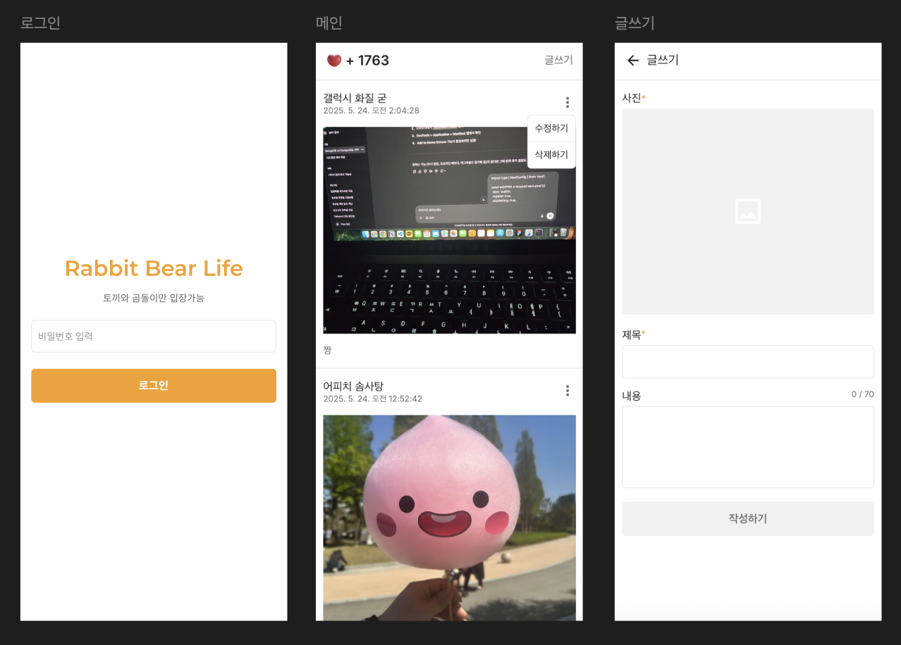

## Rabbit Bear Life

남자친구와 함께 일상을 공유할 수 있도록 만든 토이 프로젝트입니다.  
둘이서만 확인가능하도록 로그인 기능을 구현하고, 커플 디데이를 확인할 수 있습니다.  
둘이서만 간단하게 사용할 목적이므로 회원가입 페이지는 생략되었습니다.

또한 사용하기 편리하도록 PWA 설정을 통해 핸드폰 배경화면에 어플처럼 사용할 수 있도록 하여 접근성을 높였습니다.

<figure>
  
  <figcaption>개발된 화면 캡처</fitcaption>
</figure>

### 라이브러리

```bash
"@emotion/react": "^11.14.0",
"@emotion/styled": "^11.14.0",
"@tanstack/react-query": "^5.76.1",
"cloudinary": "^2.6.1",
"firebase": "^11.7.3",
"jose": "^6.0.11",
"next": "15.3.2",
"next-cloudinary": "^6.16.0",
"next-pwa": "^5.6.0",
"react": "^19.0.0",
"react-dom": "^19.0.0",
"react-hook-form": "^7.56.3"
```
